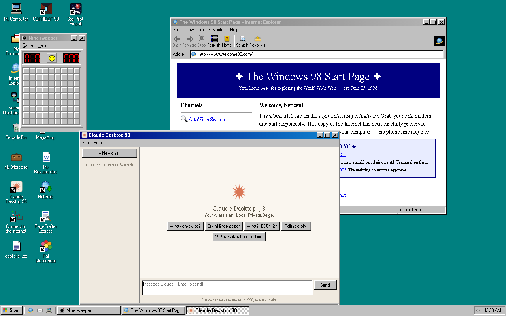
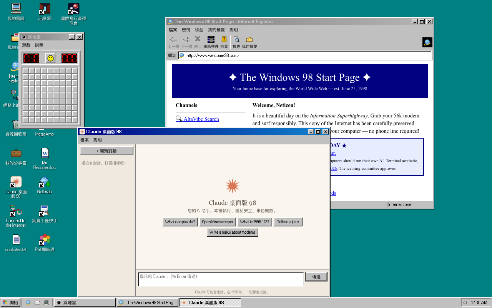

# Windows 98 — Nostalgia Edition for macOS

**English** · [繁體中文](#windows-98--macos-懷舊復刻版)

A fully interactive recreation of a lived-in 1998 PC, shipped as a tiny native macOS app.
Nothing is a prop: **61 programs, 14 games, a 19-site offline internet, a BBS, a print
spooler, a home network, and an AI assistant** all actually work — and everything you do
persists between sessions.



## Run it

```bash
./build.sh
open "Windows 98.app"
```

Requirements: Xcode Command Line Tools (`swiftc`) and Python 3. No third-party
dependencies — the whole OS is hand-written HTML/CSS/JS inside a Swift + WKWebView shell.

## Highlights

| | |
|---|---|
| **Desktop** | Boot/shutdown sequences, draggable icons, Alt+Tab switcher, right-click menus on everything, screensavers (3D Maze, Plasma, Pipes…), themes, Active Desktop channel bar |
| **Files** | A persistent virtual C: drive — Explorer with details/web views, Recycle Bin, Briefcase sync, ZipMaster archives, and real **drag-in import / save-panel export** to your Mac |
| **Internet** | IE browsing a 19-site 1998 web (search engine, shop with checkout, guestbooks, a cat page), Internet Mail, Pal Messenger, IRC with bot channels, NetMeet video calls at 4 fps, a dial-up BBS with message boards and a door game |
| **Software** | Office suite, WordPad with a cat assistant, spreadsheet with live formulas, Paint, PhotoGoo warping toy, Composer 98 step sequencer, MegaAmp, SurrealPlayer (it rebuffers, always), print pipeline with a spooler and one perpetually jammed printer |
| **Games** | Minesweeper, Solitaire, FreeCell, Hearts, pinball with multiball, a ski game with a hungry legend, **CORRIDOR 98** (a software-rendered raycasting FPS), Stackz, and DOS-mode SNAKE, GORILLA, and a working QBasic interpreter |
| **Claude Desktop 98** | An AI assistant back-ported 27 years: launches programs, does math, reads and writes real files, searches the tiny web, and streams replies at a proud 28.8k |
| **Languages** | Full English and Traditional Chinese UI — menus, dialogs, Help library, encyclopedia and the assistant. Switch in Control Panel → Regional Settings |

## Nice details

- Drop any file from Finder onto the window to import it; right-click any file →
  **Export to Mac…** for a native save panel.
- The Help library documents every feature in both languages (39 topics).
- `PING`, `TRACERT`, `IPCONFIG` work at the DOS prompt. So does `DELTREE C:\WINDOWS`, once.
- Your era-authentic assets are loadable: put `.wav` files in
  `~/Library/Application Support/Win98/Sounds/` and branding art in `…/Branding/` —
  the built-in stand-ins are all original work, so the repo stays clean.

## Project layout

| Path | What |
|---|---|
| `native/main.swift` | AppKit shell: WKWebView, persistence bridge, sound/branding scan, export panel |
| `web/js/` | The operating system — window manager, VFS, 61 apps, i18n layer |
| `web/js/apps/` | One file per program |
| `build.sh` | Compiles and signs `Windows 98.app` (ad hoc) |

---

# Windows 98 — macOS 懷舊復刻版

[English](#windows-98--nostalgia-edition-for-macos) · **繁體中文**

一台「有人住過」的 1998 年電腦的完整互動復刻，以輕量原生 macOS 應用程式呈現。
這裡沒有任何擺設：**61 個程式、14 款遊戲、19 個網站的離線網際網路、BBS、
列印佇列、家用網路和一位 AI 助手**全部真的能用 — 而且您做的一切都會保留到下次開機。



## 執行方式

```bash
./build.sh
open "Windows 98.app"
```

需求：Xcode Command Line Tools（`swiftc`）與 Python 3。零第三方相依 —
整個作業系統是手寫的 HTML/CSS/JS，跑在 Swift + WKWebView 外殼裡。

## 亮點

| | |
|---|---|
| **桌面** | 開機/關機流程、可拖曳圖示、Alt+Tab 切換器、無處不在的右鍵選單、螢幕保護程式（3D 迷宮、電漿、水管…）、佈景主題、Active Desktop 頻道列 |
| **檔案** | 持久化的虛擬 C: 磁碟 — 檔案總管（詳細資料/網頁檢視）、資源回收筒、公事包同步、ZipMaster 壓縮檔，以及與 Mac 之間的**拖曳匯入 / 儲存面板匯出** |
| **網際網路** | 用 IE 瀏覽 19 個 1998 年網站（搜尋引擎、能結帳的商店、訪客簿、貓咪主頁）、Internet 郵件、Pal 即時通、有機器人頻道的 IRC、每秒 4 格的 NetMeet 視訊通話、有留言板和門遊戲的撥號 BBS |
| **軟體** | Office 套件、有貓咪助手的 WordPad、即時公式試算表、小畫家、照片捏捏樂、作曲家 98 音序器、MegaAmp、SurrealPlayer（它一定會重新緩衝）、含佇列與一台永遠卡紙印表機的列印管線 |
| **遊戲** | 踩地雷、接龍、新接龍、傷心小棧、有多球模式的彈珠台、有飢餓傳說的滑雪遊戲、**走廊 98**（軟體渲染的光線投射 FPS）、疊疊樂，以及 DOS 模式的 SNAKE、GORILLA 和真的能寫程式的 QBasic |
| **Claude 桌面版 98** | 被移植回 27 年前的 AI 助手：啟動程式、算數學、讀寫真實檔案、搜尋小小網路，並以引以為傲的 28.8k 速度串流回覆 |
| **語言** | 完整的英文與繁體中文介面 — 選單、對話方塊、說明文件庫、百科全書與助手。在 控制台 → 地區設定 切換 |

## 講究的細節

- 從 Finder 把任何檔案拖進視窗即可匯入；在檔案上按右鍵 → **匯出到 Mac…** 開啟原生儲存面板。
- 說明文件庫以雙語記載每一項功能（39 個主題）。
- DOS 提示字元的 `PING`、`TRACERT`、`IPCONFIG` 都能用。`DELTREE C:\WINDOWS` 也能用 — 一次。
- 可載入您自己的時代原版素材：把 `.wav` 放進
  `~/Library/Application Support/Win98/Sounds/`、商標圖放進 `…/Branding/` —
  內建替代品皆為原創，讓程式庫保持乾淨。

## 專案結構

| 路徑 | 內容 |
|---|---|
| `native/main.swift` | AppKit 外殼：WKWebView、持久化橋接、音效/商標掃描、匯出面板 |
| `web/js/` | 作業系統本體 — 視窗管理、虛擬檔案系統、61 個應用程式、i18n 層 |
| `web/js/apps/` | 一個程式一個檔案 |
| `build.sh` | 編譯並簽署 `Windows 98.app`（ad hoc） |

---

© Fangyuan Lin · [fangyuanlin.com](https://www.fangyuanlin.com)
