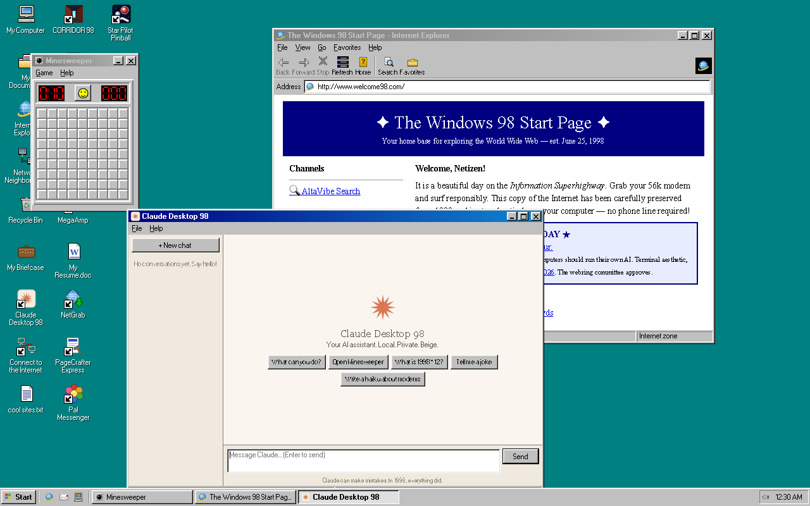
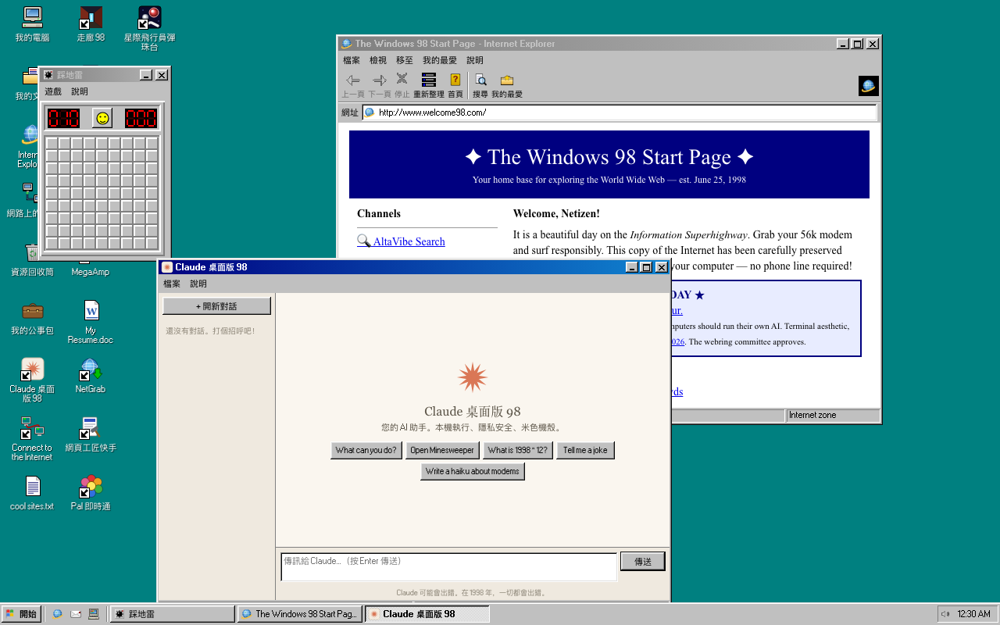

# Windows 98 — Nostalgia Edition for macOS

[](https://github.com/Fangyuan025/win98/releases)
[](https://github.com/Fangyuan025/win98/releases/latest)
[](https://github.com/Fangyuan025/win98/blob/main/native/main.swift)
[](https://github.com/Fangyuan025/win98/tree/main/web/js/apps)
[](https://github.com/Fangyuan025/win98/blob/main/web/js/apps/corridor.js)
[](https://github.com/Fangyuan025/win98/blob/main/web/js/i18n.js)
[](https://github.com/Fangyuan025/win98/blob/main/docs/screenshot-en.png)

**English** · [繁體中文](#windows-98--macos-懷舊復刻版)

A fully interactive recreation of a lived-in 1998 PC, shipped as a tiny native macOS app.
Nothing is a prop: **67 programs, 14 games, a BBS, a print spooler, a home network,
an AI assistant, and working dial-up internet** — its own 19-site 1998 web plus a live
bridge to the real one — all actually work, and everything you do persists between sessions.



## Run it

```bash
./build.sh
open "Windows 98.app"
```

Requirements: Xcode Command Line Tools (`swiftc`) and Python 3. No third-party
dependencies — the whole OS is hand-written HTML/CSS/JS inside a Swift + WKWebView shell.

## Highlights

| | |
|---|---|
| **Desktop** | Boot/shutdown sequences, draggable icons, Alt+Tab switcher, right-click menus on everything, screensavers (3D Maze, Plasma, Pipes…), themes, Active Desktop channel bar |
| **Files** | A persistent virtual C: drive — Explorer with details/web views, Recycle Bin, Briefcase sync, ZipMaster archives, and real **drag-in import / save-panel export** to your Mac |
| **Internet** | Dial-up first: no connection, no web (one phone line — the BBS and the ISP fight over it). IE browses a 19-site 1998 web *and* the real one, re-rendered in period style — Wikipedia, search engines, working forms. **Media Player 98** plays actual YouTube / Bilibili / Vimeo video, and Internet Mail, Pal Messenger, IRC, NetMeet and the BBS round out the neighborhood |
| **Software** | Office suite, WordPad with a cat assistant, spreadsheet with live formulas, Paint, PhotoGoo warping toy, Composer 98 step sequencer, MegaAmp, SurrealPlayer (it rebuffers, always), print pipeline with a spooler and one perpetually jammed printer |
| **Games** | Minesweeper, Solitaire, FreeCell, Hearts, pinball with multiball, a ski game with a hungry legend, **CORRIDOR 98** (a software-rendered raycasting FPS), Stackz, and DOS-mode SNAKE, GORILLA, and a working QBasic interpreter |
| **Claude Desktop 98** | An AI assistant back-ported 27 years: launches programs, does math, reads and writes real files, searches the tiny web, and streams replies at a proud 28.8k |
| **Autopilot 98** | Hand the machine to BOB, a ghost user with a drifting cursor and 29 expert skills. He wins Minesweeper by deduction, banks Spider runs, plans FreeCell two moves deep, clears Stackz lines, hunts the Corridor goo by pathfinding — and writes letters with typos he then regrets. Press ESC to take the computer back |
| **1998 happens to you** | Pure-chance era events: chain letters arrive, a popup declares you the 1,000,000th visitor, someone picks up the phone mid-download, Windows finds hardware that does not exist, and — rarely, honestly — a blue screen. An improper shutdown earns you ScanDisk at boot |
| **Languages** | Full English and Traditional Chinese UI — menus, dialogs, Help library, encyclopedia and the assistant. Switch in Control Panel → Regional Settings |

## Nice details

- Drop any file from Finder onto the window to import it; right-click any file →
  **Export to Mac…** for a native save panel.
- The Help library documents every feature in both languages (39 topics).
- `PING`, `TRACERT`, `IPCONFIG` work at the DOS prompt. So does `DELTREE C:\WINDOWS`, once.
- Type any modern address into IE: pages arrive gray, serif, and full of blue links.
  JS-only sites get rendered for real first; legacy GB2312/Big5 pages decode correctly.
- Your era-authentic assets are loadable: put `.wav` files in
  `~/Library/Application Support/Win98/Sounds/` and branding art in `…/Branding/` —
  the built-in stand-ins are all original work, so the repo stays clean.

## Project layout

| Path | What |
|---|---|
| `native/main.swift` | AppKit shell: WKWebView, localhost server, web-fetch/render bridge, persistence, export panel |
| `web/js/` | The operating system — window manager, VFS, i18n layer, BOB (`autopilot.js`), era events (`events.js`) |
| `web/js/apps/` | One file per program, 67 of them |
| `devserver.py` | Dev loop: serves `web/` at `localhost:8098` for browser iteration |
| `build.sh` | Compiles and signs `Windows 98.app` (ad hoc) |
| `docs/MODDING.md` | How to write and add your own programs |

## Make your own programs

Every program is one dependency-free file, and adding one is an afternoon
project: register on `W98.Apps`, build a window with `WM.create()`, add a
Start-menu line, draw a 32×32 icon on canvas — and optionally teach BOB to
use it. The full walkthrough (with a complete pasteable example app) is in
**[docs/MODDING.md](docs/MODDING.md)**.

---

# Windows 98 — macOS 懷舊復刻版

[English](#windows-98--nostalgia-edition-for-macos) · **繁體中文**

一台「有人住過」的 1998 年電腦的完整互動復刻，以輕量原生 macOS 應用程式呈現。
這裡沒有任何擺設：**67 個程式、14 款遊戲、BBS、列印佇列、家用網路、一位 AI 助手，
以及真的要撥號的網際網路** — 自帶 19 個 1998 年網站，還有一座通往真實網路的橋 —
全部真的能用，而且您做的一切都會保留到下次開機。



## 執行方式

```bash
./build.sh
open "Windows 98.app"
```

需求：Xcode Command Line Tools（`swiftc`）與 Python 3。零第三方相依 —
整個作業系統是手寫的 HTML/CSS/JS，跑在 Swift + WKWebView 外殼裡。

## 亮點

| | |
|---|---|
| **桌面** | 開機/關機流程、可拖曳圖示、Alt+Tab 切換器、無處不在的右鍵選單、螢幕保護程式（3D 迷宮、電漿、水管…）、佈景主題、Active Desktop 頻道列 |
| **檔案** | 持久化的虛擬 C: 磁碟 — 檔案總管（詳細資料/網頁檢視）、資源回收筒、公事包同步、ZipMaster 壓縮檔，以及與 Mac 之間的**拖曳匯入 / 儲存面板匯出** |
| **網際網路** | 先撥號才有網（一條電話線 — BBS 和 ISP 得搶著用）。IE 能瀏覽 19 個內建 1998 年網站，也能上**真實的現代網路**並以 1998 風格重新呈現 — Wikipedia、搜尋引擎、可用的表單。**Media Player 98** 播放真正的 YouTube / Bilibili / Vimeo 影片，加上 Internet 郵件、Pal 即時通、IRC、NetMeet 和撥號 BBS |
| **軟體** | Office 套件、有貓咪助手的 WordPad、即時公式試算表、小畫家、照片捏捏樂、作曲家 98 音序器、MegaAmp、SurrealPlayer（它一定會重新緩衝）、含佇列與一台永遠卡紙印表機的列印管線 |
| **遊戲** | 踩地雷、接龍、新接龍、傷心小棧、有多球模式的彈珠台、有飢餓傳說的滑雪遊戲、**走廊 98**（軟體渲染的光線投射 FPS）、疊疊樂，以及 DOS 模式的 SNAKE、GORILLA 和真的能寫程式的 QBasic |
| **Claude 桌面版 98** | 被移植回 27 年前的 AI 助手：啟動程式、算數學、讀寫真實檔案、搜尋小小網路，並以引以為傲的 28.8k 速度串流回覆 |
| **託管 98** | 把電腦交給幽靈使用者 BOB：游標帶著人味飄移，身懷 29 項專家技能 — 用真推理贏踩地雷、蜘蛛接龍收整套、新接龍算兩步、疊疊樂消行、用尋路演算法獵走廊 98 的黏液怪 — 還會打錯字然後懊悔地退格。按 ESC 隨時拿回電腦 |
| **1998 會找上你** | 純機率時代事件：連鎖信寄達、彈窗宣布你是第 1,000,000 位訪客、下載到一半有人拿起電話、Windows 找到不存在的硬體，還有 — 很少、但誠實地 — 藍畫面。不正常關機，開機就是 ScanDisk |
| **語言** | 完整的英文與繁體中文介面 — 選單、對話方塊、說明文件庫、百科全書與助手。在 控制台 → 地區設定 切換 |

## 講究的細節

- 從 Finder 把任何檔案拖進視窗即可匯入；在檔案上按右鍵 → **匯出到 Mac…** 開啟原生儲存面板。
- 說明文件庫以雙語記載每一項功能（39 個主題）。
- DOS 提示字元的 `PING`、`TRACERT`、`IPCONFIG` 都能用。`DELTREE C:\WINDOWS` 也能用 — 一次。
- 在 IE 輸入任何現代網址：頁面以灰底、襯線字和滿滿的藍色連結送達。
  純 JS 網站會先真實渲染再復古化；GB2312/Big5 老站正確解碼不亂碼。
- 可載入您自己的時代原版素材：把 `.wav` 放進
  `~/Library/Application Support/Win98/Sounds/`、商標圖放進 `…/Branding/` —
  內建替代品皆為原創，讓程式庫保持乾淨。

## 專案結構

| 路徑 | 內容 |
|---|---|
| `native/main.swift` | AppKit 外殼：WKWebView、localhost 伺服器、網頁抓取/渲染橋接、持久化、匯出面板 |
| `web/js/` | 作業系統本體 — 視窗管理、虛擬檔案系統、i18n 層、BOB（`autopilot.js`）、時代事件（`events.js`） |
| `web/js/apps/` | 一個程式一個檔案，共 67 個 |
| `devserver.py` | 開發迴圈：在 `localhost:8098` 提供 `web/`，方便瀏覽器迭代 |
| `build.sh` | 編譯並簽署 `Windows 98.app`（ad hoc） |
| `docs/MODDING.md` | 如何編寫並加入你自己的程式 |

## 做你自己的程式

每個程式都是一個零相依的檔案，新增一個就是一個下午的工程：掛上
`W98.Apps`、用 `WM.create()` 建視窗、在開始選單加一行、在 canvas 上畫
32×32 圖示 — 還可以教 BOB 使用它。完整教學（含可直接貼上的完整範例
程式）在 **[docs/MODDING.md](docs/MODDING.md)**。

---

© Fangyuan Lin · [fangyuanlin.com](https://www.fangyuanlin.com)
